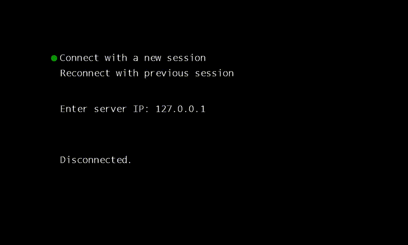

# Ping Pong - Online Multiplayer
**Disclaimer: Work in Progress**

This Game is based on the classic Ping Pong Game which was one of the first games ever to hit the Arcade World. We wanted to develop a online game for fun and educational purposes. And to dig deep with all the needed technologies like: Game Server, Game Client, Matchmaking, Networking(UDP & TCP fighting NAT-Traversal ), Mutli Threading etc.

We are hosting a Server on: x.x.x.x to which you can connect to for trying it out (for an indefinte period of time) . 

## Features 
### Rejoining a Game
You lost connection during the game ? Maybe due to your unreliable internet connection or because someone plugged your network cable. 
No Problem just reconnect with your previous session and you will be able to rejoin your game

### Matchmaking

Search for games and the server will automatically connect you with other players who als want to play

### Multi Player Local

Multiple Players can play on the same keyboard, so you can also play with your friends on the same Machine.
You will just be using different keys (UP, DOWN) and the other might use 2 and 8 for example.

### Observer

You don't feel like playing ping pong today ? But you still need to feed your Ping Pong Addiction ? 
Observer mode allows you to secretly watch other people play the game.

### Game Over Screen
Also a Game Over Animation because why not :) . 
 

## How to build the Client

The project was developed with Visual Studio 2017 in C# 
Additionally you need XNA: follow this setup guide for Visual Studio 2017 : http://flatredball.com/visual-studio-2017-xna-setup/

1. git clone git@github.com:ThoenigAdrian/PingPong.git 
2. git submodule update --init
3. Open PingPongClient/PingPongClient.sln with Visual Studio 2017
4. In case you get a Error Message about: Project Target Framework Not Installed regarding ManagedOpenSsl (see image below) - make sure to install .NET Framework 2.0 (included with .NET Framework 3.5) you can get it from [here](https://www.microsoft.com/de-at/download/details.aspx?id=1639) 

5. (Optional) Change build type to Debug or Release
6. Click Start in Visual Studio

## How to build the Server

The project was developed with Visual Studio 2017 in C# 

1. git clone git@github.com:ThoenigAdrian/PingPong.git 
2. git submodule update --init
3. Open PingPongServer/PingPongServer.sln with Visual Studio 2017
4. In case you get a Error Message about: Project Target Framework Not Installed regarding ManagedOpenSsl (see image below) - make sure to install .NET Framework 2.0 (included with .NET Framework 3.5) you can get it from [here](https://www.microsoft.com/de-at/download/details.aspx?id=1639) 

5. (Optional) Change build type to Debug or Release
6. Click Start in Visual Studio

## Used Libraries
### XS Library
This PingPong project heavily uses the XSLibrary which contains useful code for mutlithreading and networking (as well as other things) 
Check it out here: https://github.com/CaptainOachkatzl/XSLibrary . 
### Newtonsoft JSON
For JSON Parsing the newtonsoft library is used: https://github.com/JamesNK/Newtonsoft.Json
